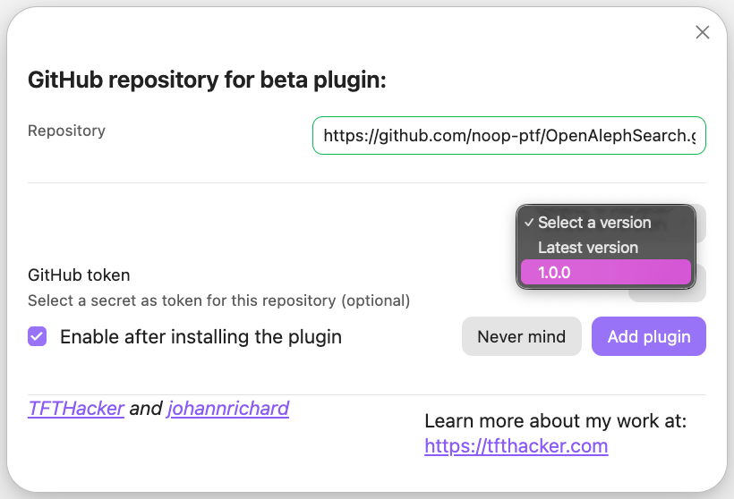
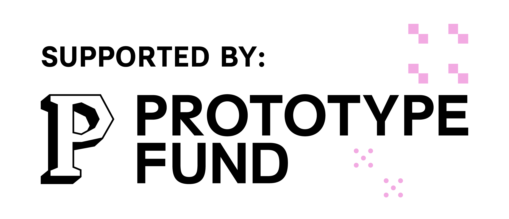

# OpenAleph Search for Obsidian

This Obsidian plug-in allows a user to search through many different OpenAleph instances simultaneously.

Most OpenAleph instances are configured to only allow a user to search when they are logged in. In the OpenAleph Search plug-in, a user can configure an OpenAleph instance to have an API key associated with it.

Using this plug-in, a user can pull search results into their own Obsidian vault. Each result is a [Follow the Money](https://followthemoney.tech/) entity. The properties are rendered as [Markdown frontmatter](https://frontmatter.codes/docs/markdown) at the top of the note. This note is saved in a separate directory, with a configurable name (by default, `followthemarkdown`).

These Markdown files, containing Follow the Money entities, we have affectionately called "Follow the Markdown". They are meant to be treated as a source of information, not edited. They can be referenced in other notes, by using their title, in the WikiLinks notation: `[[Name of Enitty]]`.

This plug-in was built in order to explore building tooling for investigators and researchers. The plug-in connects a well-known tool for drafting notes, and organizing knowledge (Obsidian) with OpenAleph instances (acting, here, as knowledge bases).

⚠️ This plug-in is in an Alpha stage. It _may_ still contain bugs. If you would like to report a bug or request a feature, please [open an Issue](https://codeberg.org/Noop/OpenAlephSearch/issues).

## Why, though?

The [OpenAleph](https://openaleph.org/) free and open-source software is a staple of journalistic investigations. It is a platform that allows users to upload large volumes of data and make sense of what is inside. OpenAleph can reveal names, addresses, and other interesting artefacts. It makes all uploaded data searchable, and can translate betwen languages. The more [advanced](https://openaleph.org/blog/2025/openaleph-51-released-reworked-synonym-search-and-new-tagging-feature/#improved-search-for-names-and-their-synonyms) search features allow users to ["hydrate"](https://openaleph.org/blog/2025/when-names-travel-together-discover-correlations-in-your-data/#closely-correlated-names) their search terms with additional context, or to perform [reverse search](https://openaleph.org/blog/2026/how-to-use-the-new-screening-feature/).

DARC, the company that maintains OpenAleph, has [a public instance](https://search.openaleph.org/) with open-source data that can be searched by anything. No account required. There are many other instances like this, belonging to researchers and journalists.

OpenAleph Search allows users to send a search query to multiple OpenAleph instances, simultaneously, and import the relevant results into their Obsidian vault. In this sense, it federates search across both private and public instances that the user has access to.

## Installation

You must have [Obsidian](https://obsidian.md/) installed in order to use this plug-in.

Your Obsidian app version must be equal or large than `1.11.4`. You can see the version by opening the **Settings** and navigating to the **General** section. If you have an older version of Obsidian, [upgrade to a more recent version](https://obsidian.md/help/updates).

We are working to publish this plug-in among the [Community plug-ins](https://community.obsidian.md/). Until then, there are two ways to install this plug-in. Below, we guide you through both.

### Install using the BRAT plug-in

If you already have the Beta Reviewers Auto-update Tester plug-in (called BRAT), you can add `https://github.com/noop-ptf/OpenAlephSearch.git` and select the latest version of this plug-in.

### Install from source code

1. Make sure you have NodeJS installed, and that the version is at least v18 (`node --version`). If you don't have NodeJS installed, follow [the official instructions](https://nodejs.org/en/download)
2. Navigate to the plug-ins directory of your Obsidian vault (usually located at `VaultName/.obsidian/plugins/your-plugin-id/`). Here, run `git clone https://github.com/noop-ptf/OpenAlephExplore.git`.
3. Navigate into the newly-created directory, that contains the source code, and install the dependencies: `npm i`
4. Run `npm run build`. This should produce three files: `main.js`, `styles.css`, `manifest.json`.
5. Open Obsidian, navigate to the **Settings** > **Community plugins** and refresh the list of plug-ins. OpenAleph Search should appear. Enable it.

## Tentative roadmap

Here are future functionalities we are considering. If you want to suggest something else you would like to see added to this plug-in, feel warmly invited to open an Issue.

- [ ] allow users to add properties to Follow the Money entities and push these back into an OpenAleph instance
- [ ] the following Follow the Money entities are now excluded from search: Article, Audio, Email, File, Folder, HyperText, Image, Page, Pages, Table, Video, Workbook, because they have properties that contain lengthy (or binary data). Implement the exclusion of these properties and allow the user to import these as notes, for the metadata
- [ ] import the highlight snippets from OpenAleph and display them in the Note text when a user imports an Entity
- [ ] allow the user to set a colour for every instance and add it to the border of all entities from that instance

## Related projects

[OpenAleph Explore](https://github.com/noop-ptf/OpenAlephExplore) allows users to use any note they have written to perform inverse search across multiple OpenAleph instances, and then further refine the results with terms that are very closely correlated to them.

## Social media

The **noop** team is [active on Mastodon](https://chaos.social/@noop), and will share news about releases, demos and other tidbits. You can also follow the individual developers: [zormit](https://chaos.social/@zormit) and [catileptic](https://chaos.social/@catileptic).

## Sponsor

OpenAleph Search for Obsidian is funded by the German **Federal Ministry of Research, Technology and Space (BMFTR)** through the **[Prototype Fund](https://prototypefund.de)** under funding code (Förderkennzeichen) **16IS26S15**.

